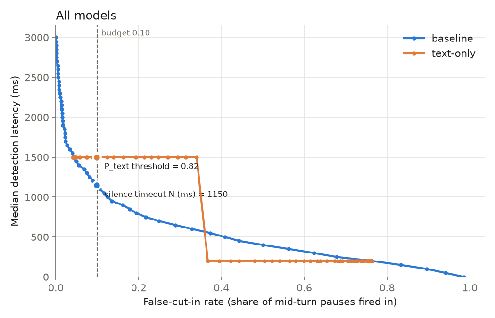
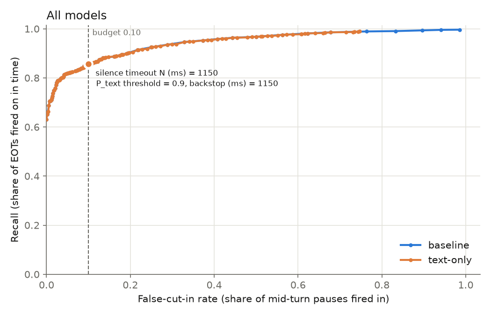

# Turn Detector: Solution

Domain terms (EOT, mid-turn pause, firing, false cut-in, detection latency, request latency, …) are defined in [`CONTEXT.md`](../CONTEXT.md). Decisions are recorded in [`docs/adr/`](adr/).

## Summary

The detector decides, during each pause in the user's speech, whether the user has finished their turn. Four models are compared on the TurnBench dev set (38 two-channel conversations, about 7 h), split by speaker into 26 development and 12 held-out conversations ([ADR 0003](adr/0003-train-on-turnbench-dev.md)):

- **baseline**: a silence timeout, which is what plain VAD achieves;
- **text-only**: a frozen MiniLM sentence encoder and a logistic-regression head. It reads the agent's previous turn and the user's current turn so far (at most the last 64 tokens of the two), not the whole conversation, once per pause, 200 ms after the user stops speaking;
- **audio-only**: a frozen wav2vec2-base encoder and a logistic-regression head over the last 1 s of audio, every 50 ms;
- **combined**: late fusion of the two probabilities and the silence duration, every 50 ms. Its P_text reads the same two turns as the text-only model, as of the latest pause whose text has arrived.

Each trained model fires when its P(EOT) reaches a threshold, or else at a silence backstop. The two knobs are chosen by cross-validation with one speaker group held out per fold, using TurnBench's rule: the highest recall at a false-cut-in rate of 0.10 or less. Everything is scored with TurnBench's own EOT scorer. The models are served by a stateless FastAPI service in a CPU Docker image and stress-tested with Locust. How to run all of it is in the [README](../README.md).

**Result: on the held-out conversations, no trained model beats the silence timeout** (likely reasons in [Why no trained model beats the timeout](#why-no-trained-model-beats-the-timeout)). All four reach a recall of 0.85–0.88. All four also exceed the 0.10 false-cut-in budget (0.125–0.142), because the held-out speakers pause longer within their turns than the development speakers. The audio-only model is the only one that fires early with any regularity (p10 detection latency 551 ms), but its later backstop costs median latency. Text-only requests meet the <100 ms request-latency target on the laptop. Audio requests do not (about 130 ms alone), a limitation of running everything on one MacBook Air ([ADR 0002](adr/0002-laptop-only-compute.md)).

## Training samples

Every training sample starts from a **pause**: a point where one of the user's speech segments ends.

- **Where the segments and labels come from.** TurnBench gives each speaker's channel three annotators' segment lists. Its own gold construction, reused here (`turn_detector.events`), keeps a segment only when 2 of 3 annotators agree on its start and end within ±200 ms.
- **How a segment end is labelled.** It is an **EOT** when the other speaker takes the floor next, or when it is the speaker's last turn. It is the start of a **mid-turn pause** when the same speaker resumes first. Segment ends without agreement are not trained on.
- **Who counts as the user.** Each speaker of a conversation is the user in turn.

The 26 development conversations give 1392 EOTs and 711 mid-turn pauses. Each model turns them into samples differently:

| Model | One sample | Label | Samples on development |
|---|---|---|---:|
| text-only | One labelled pause: the other speaker's previous turn and the user's turn so far (the last 64 tokens), as of the segment end | EOT or mid-turn pause | 2103 (1392 EOT, 711 mid-turn) |
| audio-only | One 50 ms step of a labelled pause, up to 1 s into it or until the user resumes: the last 1 s of audio ending at that step, plus the silence so far | The pause's label | 34,584 (26,761 EOT, 7823 mid-turn) |
| | One point per second inside each speech segment: the last 1 s of audio, with zero silence | Not EOT | 16,452 |
| combined | The audio-only model's pause steps: out-of-fold P_audio, the latest P_text whose text has arrived, and the silence so far | The pause's label | 34,584 |

How the audio samples are spread has consequences:

- **Mid-turn pauses supply far fewer steps.** An EOT pause usually supplies all of its steps: a median of 20, because the user stays silent for at least a second. A mid-turn pause supplies a median of 10 steps, because the user resumes after about half a second. So EOT steps outnumber mid-turn steps 3.4 to 1 within pauses, and late in a pause nearly every step is an EOT. The silence duration alone therefore separates the classes well, as it does for the timeout.
- **The samples are not independent.** Neighbouring steps of one pause hear almost the same audio. This is why the audio head needs strong regularisation.

The audio and combined models are trained up to 1 s into a pause but listen up to 3 s in at evaluation (see [What the audio-only model adds](#what-are-the-limits-of-the-current-solution)).

## Results

### Held-out conversations

The 12 held-out conversations were scored once, in a single run (`scripts/evaluate_held_out.py`), with no tuning afterwards. Each model is its final version, trained on all 26 development conversations, at the setting chosen in cross-validation. The audio is heard through the same code the API serves. Full table: [`results/comparison/results.md`](../results/comparison/results.md).

| Model | Setting | Recall | False-cut-in rate | Detection latency p10 / p50 / p90 (ms) |
|---|---|---:|---:|---:|
| baseline | timeout 1150 ms | 0.877 | 0.142 | 1150 / 1150 / 1150 |
| text-only | P_text ≥ 0.9, backstop 1150 ms | 0.881 | 0.142 | 1150 / 1150 / 1150 |
| audio-only | P_audio ≥ 0.946, backstop 1500 ms | 0.854 | 0.125 | 551 / 1500 / 1500 |
| combined | P ≥ 0.926, backstop 1150 ms | 0.877 | 0.142 | 1150 / 1150 / 1150 |
| *VAP (published, TurnBench test set)* | | *0.845* | *0.055* | *−57 / 368 / 1537* |
| *Pipecat Smart Turn v3 (published, TurnBench test set)* | | *0.752* | *0.047* | *729 / 1017 / 1175* |

**These are the only clean numbers.** The audio model's encoder layer (8) and regularisation (C = 1e-4) were each picked once, on a third of the development conversations. The cross-validated development numbers below are therefore slightly optimistic for the audio-only and combined models. The held-out conversations played no part in any choice.

**They are uncertain.** The held-out set has 512 EOTs and 352 mid-turn pauses. A 95% binomial interval is about ±0.03 on recall and ±0.04 on the false-cut-in rate, and wider in truth, since the pauses of one conversation are correlated. The recall differences between the models are inside that.

**The published rows are outside references, not a like-for-like comparison:**

- They are scored on TurnBench's test set, a different and larger split, at an operating point chosen on the whole dev set. The numbers come from TurnBench's `results/leaderboard-test.json` at the commit this project pins.
- They are trained on far more data. VAP was trained on Switchboard and Fisher, then fine-tuned on TurnBench's 104 h training set. Smart Turn v3 was trained on Pipecat's own turn-completion data. Ours saw about 5 h.
- They find pauses in the audio themselves. Our models are given the annotators' segment ends (a perfect VAD) and, for text, human transcripts (a perfect ASR). This favours our models.

Even with that advantage, VAP reaches a similar recall at well under half the false-cut-in rate and a median detection latency of 368 ms. That is the region a production detector should aim for, and none of the models here gets close to it.

### What the held-out results show

Counts of confident and backstop firings below come from a one-off diagnostic run after the held-out evaluation, which re-applied each saved model's firing rule to the held-out conversations without changing anything. They are not in a recorded results file.

- **The false-cut-in budget did not transfer.** The same 1150 ms timeout cuts in on 9.8% of the development conversations' mid-turn pauses and on 14.2% of the held-out ones. The held-out speakers simply pause longer mid-turn. A threshold tuned on 26 conversations fixes the firing rule, not the false-cut-in rate, which depends on how the speakers pause. In production that calls for per-deployment calibration and monitoring of the false-cut-in proxy (see [Monitoring in production](#monitoring-in-production)).
- **Text-only is the baseline in practice.** Of its 545 held-out firings, 5 were confident (P_text ≥ 0.9, 200 ms into the pause) and 540 came from the backstop. Those 5 firings gained 2 EOTs, which is not a measurable difference. This matches the development finding that its head ranks EOTs above mid-turn pauses barely better than chance (see [Why the text model barely beats the baseline](#what-are-the-limits-of-the-current-solution)).
- **Combined is the baseline exactly, as development predicted.** Its final model never reached the 0.926 threshold on the held-out conversations: all 543 firings came from its 1150 ms backstop, the baseline's timeout. That is not a shift between the cross-fitted heads and the final one. At the chosen setting the combined model was already the baseline on development: scored by the cross-fitted heads, it has the baseline's recall (0.857) and detection latency (1150 ms at p10, p50 and p90), with one extra false cut-in (71 against 70). A diagnostic run on development conversations only, after the held-out evaluation, found that about 0.2% of EOTs and 0.1% of mid-turn pauses reach 0.926 before the backstop under the cross-fitted heads, and none under the final model. The best setting within the budget was, in effect, early firing switched off (see [What the combined model adds to audio](#what-are-the-limits-of-the-current-solution)).
- **Audio-only is the only model that fires early.** 194 of its 525 held-out firings were confident, and its p10 detection latency, 551 ms, is close to its cross-validated 506 ms. That carries over from development. But its chosen backstop is 1500 ms, so the other firings wait longer than the baseline's, and its median detection latency is 1500 ms against 1150 ms. Its false-cut-in rate is lower (0.125 against 0.142) and its recall lower too (0.854 against 0.877). Whether that is a better trade-off than the baseline's cannot be told from one point each, and the held-out set is scored only once, so there is no held-out sweep to compare them on.
- **The expectation in [Audio, text, combined, or VAD?](#audio-text-combined-or-vad) holds only in part.** Audio is the modality that buys early firings. With these small frozen encoders and 26 conversations of training data, it does not buy enough to beat a well-tuned timeout at TurnBench's operating point.

### Development conversations, cross-validated

Leave-one-speaker-group-out cross-validation over the 26 development conversations (9 folds). Each fold is scored at the setting chosen without it, and the folds are pooled. Each setting met the 0.10 budget on the folds it was chosen on, but the pooled false-cut-in rate of the trained models ends up above it (0.113–0.122): the budget does not fully carry over even between development speaker groups. These numbers chose the settings above, and are slightly optimistic for the audio-only and combined models (see above).

| Model | Setting chosen (per-fold range) | Recall | False-cut-in rate | Detection latency p10 / p50 / p90 (ms) |
|---|---|---:|---:|---:|
| baseline | 1150 ms (1100–1250) | 0.853 | 0.098 | 1100 / 1150 / 1200 |
| text-only | 0.9, 1150 ms (0.86–0.9, 1100–1250) | 0.857 | 0.113 | 1100 / 1150 / 1200 |
| audio-only | 0.946, 1500 ms (0.936–0.954, 1300–1600) | 0.866 | 0.113 | 506 / 1300 / 1500 |
| combined | 0.926, 1150 ms (0.894–0.926, 1100–1500) | 0.856 | 0.122 | 569 / 1150 / 1500 |

Pooling mixes the per-fold settings, so a row can describe firings the chosen setting never makes. The combined model's p10 of 569 ms comes from the folds that chose a lower threshold and a later backstop (0.894–0.902 with 1450–1500 ms). At its chosen setting, on all development conversations, its detection latency is 1150 ms at p10, p50 and p90, the same as the baseline's (`results/models/combined/sweep.csv`). The audio-only model's early firings are real: at its chosen setting its p10 is 513 ms.

The figures show each model's development sweep: at each false-cut-in rate, the best value any setting reaches. Filled dots mark the chosen settings, hollow squares the held-out scores, and grey triangles the published references.

### Request latency

Text-only requests meet the <100 ms target with margin, up to 8 requests in flight (p99 45 ms). **Audio and combined requests miss it** on the laptop container: about 130 ms and 140 ms even alone. This is a limitation of running everything on one MacBook Air ([ADR 0002](adr/0002-laptop-only-compute.md)): Docker Desktop's Linux VM, torch's slower Linux CPU build, one CPU thread per worker and no GPU. The same encoder takes about 24 ms per window natively on macOS. The reasons and the production fixes (GPU or an optimised CPU runtime, batching, a smaller encoder, streaming over a WebSocket) are in [Serving and request latency](#serving-and-request-latency).

## Why no trained model beats the timeout

This is the central result, so this section sets out what it does and does not mean, and the likely reasons. The reasons are hypotheses: each comes with the evidence we have and the check that would confirm or rule it out. None of the checks has been run.

**What "does not beat" means.** At TurnBench's operating point (the highest recall at a false-cut-in rate of 0.10 or less), no trained model reaches clearly higher recall than the silence timeout. It does not mean the models learned nothing. The audio-only model fires early on the pauses it is sure of (p10 detection latency 513 ms on development, 551 ms held-out), and elsewhere on its curve it trades a little recall for a lot of speed: recall 0.840 at a median detection latency of 936 ms, against the timeout's 0.857 at 1150 ms, at the same false-cut-in rate (see [What the audio-only model adds](#what-are-the-limits-of-the-current-solution)).

In order of how much we think each one matters:

1. **The metric leaves little to win, and rewards recall, not speed.**
   - The timeout already reaches a recall of about 0.86, and its 1150 ms setting uses almost the whole false-cut-in budget (0.098 of 0.10) on its own.
   - A trained model's real gain is firing earlier. The selection rule counts speed only as a tie-break, so it never trades recall for it.
   - To raise recall, a model has to fire within the first second on exactly the EOTs the timeout misses (199 on development). Our guess is that these are mostly EOTs where the user spoke again before the timeout, which leaves no room for early firing that doesn't also cut in.
   - *Check:* measure, for each EOT the timeout misses, how long the silence lasted before the user spoke again. Also compare the models' detection latency at a fixed recall, not their recall at a fixed false-cut-in rate.
2. **Whether a pause becomes an EOT depends on the listener, and the models don't hear the listener.**
   - TurnBench is casual conversation between two people. A pause becomes an EOT when the other person takes the floor, and a mid-turn pause when they don't. The speaker can sound the same either way.
   - Our models hear only the user's channel (the text model also reads the other speaker's previous turn), so part of the decision is invisible to them.
   - Evidence: 536 of the 711 development mid-turn pauses come right after a sentence ending in a full stop. The speaker finished a thought, nobody took the floor, and they went on. VAP, which clearly beats the timeout, models both speakers' audio together.
   - *Check:* add features of the other speaker (a backchannel just now, time since they last spoke) and see whether the ranking improves; or listen to 20 mid-turn pauses that follow a full stop and judge whether a person could tell them from EOTs.
3. **There is too little data for the cues beyond silence.**
   - About 5 h from 26 conversations gives roughly 1,400 EOTs and 700 mid-turn pauses. That is enough to learn "the longer the silence, the more likely the turn is over", which the timeout already uses. It is not enough to learn subtle prosodic or wording cues that hold across speakers.
   - Evidence:
     - The audio head needed very strong regularisation (C = 1e-4) to beat the silence duration at all, and ranks EOTs only a little better than silence alone (AUC 0.69 against 0.63 inside pauses).
     - The held-out speakers behave differently: the same timeout's false-cut-in rate rises from 0.098 to 0.142.
     - VAP and Smart Turn were trained on hundreds to thousands of hours.
   - *Check:* a learning curve. Train on half, three quarters and all of the development conversations; if the out-of-fold AUC is still rising at full size, data is the bottleneck.
4. **The encoders and heads miss the right cues.**
   - *Text:* a mean-pooled sentence embedding captures the topic, not whether the sentence is finished. It reaches an AUC of 0.51, where three handcrafted features reach 0.65, so the transcripts hold signal this encoder misses (see [Why the text model barely beats the baseline](#what-are-the-limits-of-the-current-solution)).
   - *Audio:*
     - `wav2vec2-base` was trained to recognise speech sounds, not intonation.
     - Averaging over a 1 s window blurs the final pitch fall or lengthened last syllable that signals a turn end.
     - There are no explicit pitch or energy features, and after about 1 s of silence the window holds no speech at all.
   - *Heads:* every head is linear and the fusion is late, so the combined model cannot learn interactions such as "a falling pitch matters only after a complete clause".
   - We rank this below the first three: better features would sharpen the ranking, but would not recover the listener's part of the decision or the recall the timeout already has.
   - *Check:* add pitch (F0) and energy-slope features from the last 300 ms of speech to the audio head, and score text with a small language model's end-of-turn probability. A clear AUC gain would mean the features were the limit.
5. **The setup flatters the timeout.**
   - Every model is given the annotators' segment ends, a perfect VAD.
   - A timeout depends on nothing but silence timing, so it is the model hurt most by a real VAD's jitter and clipped speech. Here it gets its best possible input.
   - *Check:* re-run the timeout on segment ends with ±100–200 ms of jitter, or on a real VAD such as Silero, and compare its drop with the audio model's.
6. **The test set is too small to see small wins.** The held-out conversations have 512 EOTs and 352 mid-turn pauses: a 95% interval of about ±0.03 on recall and ±0.04 on the false-cut-in rate, and wider in truth, since one conversation's pauses are correlated. Differences of 0.01–0.02 between the models are within noise. Part of "does not beat" is "cannot be told apart".

**What would change the result.** In order:

- More data, ideally production calls.
- A model that hears both sides of the conversation, as VAP does.
- Features made for turn ends: prosody for audio, a language model's end-of-turn probability for text.
- An operating point that values speed, chosen per deployment: for example, the lowest median detection latency at the timeout's recall.

## Serving and request latency

The text-only, audio-only and combined models are served by one stateless FastAPI service in a CPU Docker image (see the [README](../README.md#serving)). A request with audio and a transcript is answered by the combined model, one with audio only by the audio-only model, and any other request by the text-only model. The stress test sends real requests to the container with Locust, with each simulated caller sending requests back to back: the last 1 s of audio, the transcript so far, the previous turn and the silence duration, sampled from streaming a held-out conversation. For the text-only model, the requests were measured before the audio model existed, so they still carried the (then unused) audio; `--no-audio` now leaves it out. For the audio-only model, they were measured before the combined model existed, so they still carried the (then unused) text; `--no-text` now leaves it out.

**Everything here ran on one MacBook Air** (ADR 0002): the container, Docker Desktop's Linux VM and the load generator all share the laptop's 10 CPU cores, with no GPU available to the container. These numbers show where the service's limits lie on that machine. They are not what a production server would do.

### Text-only requests

Full table: [`results/models/text-only/stress_test.md`](../results/models/text-only/stress_test.md).

| Requests in flight | Throughput (req/s) | p50 (ms) | p95 (ms) | p99 (ms) |
|---:|---:|---:|---:|---:|
| 1 | 70 | 16 | 17 | 18 |
| 2 | 135 | 17 | 18 | 19 |
| 4 | 210 | 22 | 24 | 25 |
| 8 | 259 | 31 | 42 | 45 |
| 16 | 264 | 59 | 88 | 100 |
| 32 | 256 | 120 | 190 | 210 |
| 64 | 248 | 260 | 350 | 400 |

Setup: 4 uvicorn workers with 1 encoder thread each, on Docker Desktop on a 10-core Apple M5 MacBook Air. Locust ran on the same laptop. No request failed.

**Does the <100 ms target hold?** Yes, with margin, up to 8 requests in flight (p99 45 ms). At 16 requests in flight p99 reaches 100 ms, right at the limit, and beyond that the target fails. Throughput saturates at about 260 req/s from 8 requests in flight, so extra load only queues: p50 roughly doubles each time the load doubles.

Figures in the next two points that are not in the table come from one-off spot checks, not recorded runs.

- **A single request is fast.** It takes 16 ms end to end through the container, 8 ms measured inside it, and 4 ms against the same code running natively on macOS. The encoder dominates. On Linux, torch's CPU build uses OpenBLAS, about 3× slower than macOS's Accelerate for this model. Docker Desktop's port forwarding adds about 8 ms per request.
- **The ceiling is the laptop, not the service.** With 8 workers instead of 4, the ceiling barely moves (≈290 req/s). Sending the same load from inside the container reaches about 390 req/s, and running natively reaches 640–730 req/s. On a Linux server, without Docker Desktop's VM and port forwarding, a container should do noticeably better. That has not been measured here.
- **What that means in calls.** A call sends 20 requests per second while the user is silent. At 8 requests in flight (p99 45 ms), one laptop container serves about 13 calls in a pause at once. The load estimate in [How does it fit into a voice-agent architecture?](#how-does-it-fit-into-a-voice-agent-architecture) (about 1,400 req/s before peaks) would need roughly six such containers. More instances, behind a load balancer, keep each one below its knee.
- **Cheap wins, not done here.** Batch concurrent requests into one encoder call. Export the encoder to ONNX Runtime or quantise it to int8. Skip the request entirely while the transcript hasn't changed since the last one, since the text model's output only changes when new words arrive. That alone removes most of the 20 requests per second.

### Audio-only requests

Full table: [`results/models/audio-only/stress_test.md`](../results/models/audio-only/stress_test.md). Same image, same setup.

| Requests in flight | Throughput (req/s) | p50 (ms) | p95 (ms) | p99 (ms) |
|---:|---:|---:|---:|---:|
| 1 | 7.8 | 130 | 130 | 140 |
| 2 | 14 | 140 | 140 | 150 |
| 4 | 22 | 180 | 190 | 190 |
| 8 | 31 | 260 | 270 | 280 |
| 16 | 29 | 570 | 720 | 780 |
| 32 | 24 | 1300 | 1800 | 2000 |
| 64 | 20 | 3200 | 4000 | 4200 |

**Does the <100 ms target hold?** No. On this laptop, an audio request takes about 130 ms even alone, and throughput saturates at about 30 req/s, a ninth of the text model's. No request failed.

**Why it is slower.** The work per request is far larger than for text, and the laptop's container runs it on the slowest available path.

- **The encoder does about ten times the work.** wav2vec2-base runs a 7-layer convolutional feature encoder over all 16,000 samples, then 8 transformer layers (the layers above the one the head reads are dropped) over 49 frames of 768 dimensions. That is about 65M parameters, all applied to the whole second on every request. The text model runs MiniLM's 6 small layers (384 dimensions, 22M parameters) over at most 64 tokens.
- **Each worker runs it on one CPU thread, on Linux.** As with the text model, torch's Linux CPU build uses OpenBLAS, several times slower than macOS's Accelerate for these models, and Docker Desktop adds its VM and about 8 ms of port forwarding. A one-off spot check, not a recorded run: the same 8-layer encoder takes about 24 ms per window on one thread natively on macOS, against about 120 ms inside the container.
- **Four workers share a VM that also serves the load.** Beyond 4 requests in flight, requests queue behind the encoder, and beyond 8 the laptop is saturated.

**What it would take in production.** In a call the detector is asked 20 times a second while the user is silent, so one laptop container serves barely one call in a pause at once. A production deployment would change the hardware and the model before the architecture:

- run the encoder on a GPU, or on a server CPU with an optimised runtime (ONNX Runtime, int8 quantisation), and batch concurrent requests into one encoder call;
- use a smaller or distilled audio encoder: the head reads only layer 8, and the wav2vec2 features barely beat the silence duration (see [What the audio-only model adds](#what-are-the-limits-of-the-current-solution));
- stream audio over a per-call WebSocket (see [How does it fit into a voice-agent architecture?](#how-does-it-fit-into-a-voice-agent-architecture)), so the server keeps each 50 ms of audio's convolutional features and only re-runs the transformer layers on each step, instead of re-encoding the whole 1 s on every request.

### Combined requests

Full table: [`results/models/combined/stress_test.md`](../results/models/combined/stress_test.md). Same image, same setup; each request carries audio and text, so it runs both encoders.

| Requests in flight | Throughput (req/s) | p50 (ms) | p95 (ms) | p99 (ms) |
|---:|---:|---:|---:|---:|
| 1 | 7.1 | 140 | 140 | 150 |
| 2 | 12 | 170 | 180 | 180 |
| 4 | 16 | 250 | 260 | 270 |
| 8 | 20 | 400 | 430 | 440 |
| 16 | 19 | 870 | 1100 | 1200 |
| 32 | 18 | 1800 | 2300 | 2500 |
| 64 | 17 | 3600 | 4600 | 5000 |

**Does the <100 ms target hold?** No, for the same reason as the audio-only model: wav2vec2 dominates. Alone, a combined request takes about 10 ms longer than an audio-only one (140 ms against 130 ms at p50), the cost of the text encoder and the three-weight fusion. Under load, throughput saturates at about 20 req/s against the audio-only model's 30, since every request runs both encoders on the same worker threads. No request failed. What it would take in production is the audio-only model's list above. Given the result in [What the combined model adds to audio](#what-are-the-limits-of-the-current-solution), the audio-only model is the one to serve until the text classifier improves.

## Assumptions

Every result above rests on these. The first four make our numbers look better than a deployed detector would do.

**Inputs.**

- **Human transcripts instead of ASR.** The text model reads the annotators' transcripts, not a streaming ASR's. To make them look more like ASR output, bracketed tags such as `[laughs]` are stripped and fillers such as "um" are kept. Real ASR errors and unstable partial transcripts would make the text model worse.
- **Annotation segment ends instead of a real VAD.** Every model's pauses, and the silence duration the audio model reads, come from the annotators' 2-of-3 consensus segments: a perfect pause detector. A real VAD misses pauses, splits words and reacts late.
- **A fixed 200 ms ASR lag.** A segment's text becomes readable 200 ms after the segment ends, so the text model cannot fire earlier than that. Real ASR lag varies with the vendor and the utterance.
- **Gold events need 2-of-3 annotator agreement.** Pauses the annotators disagree on are neither trained on nor scored, and those are the hardest ones.
- **The segment boundaries are not independent human judgments.**
  - **What the data shows.** TurnBench's annotation is VAD-segmented: the annotators worked from a shared automatic segmentation, labelling, transcribing and occasionally editing its segments. On the dev set, 97.0% of an annotator's segments have the exact same start and end as another annotator's, to the millisecond (97.2% within the ±200 ms tolerance).
  - **What agreement filters.** The 2-of-3 agreement step mostly removes the few segments the annotators edited differently, and the ones they labelled differently (floor-holding speech against a backchannel or noise). It does not reconcile timings.
  - **What labels a pause.** Whether a pause is an EOT or a mid-turn pause is not marked by anyone. It follows from who speaks next.
  - **What it means for the results.** The pauses our models are given start at exactly the times the gold events are anchored to, so the "perfect VAD" above is the same segmentation that defines the gold. A deployed VAD would not line up this well.

**Firing rule and tuning.**

- **Backstops.** Every trained model also fires at a silence backstop if its P(EOT) never reaches the threshold. The backstop is tuned together with each model's threshold, so a trained model can always fall back to the baseline's timeout on the data it is tuned on.
- **The operating point is TurnBench's.** The highest recall at a false-cut-in rate of 0.10 or less, with ties going to the lower median detection latency. It is chosen by cross-validation that leaves one speaker group out per fold.
- **Choices made on development data.** The audio model's encoder layer (8) and regularisation (C = 1e-4) were each picked once, by out-of-fold AUC, on a third of the development conversations. The cross-validated development numbers are therefore slightly optimistic for the audio-only and combined models. Only the held-out numbers are clean.

**Data.**

- **Training on the dev set** ([ADR 0003](adr/0003-train-on-turnbench-dev.md)). TurnBench's 104 h training set needs licence approval for commercial use, so all training and evaluation use its 7 h dev set, split by speaker into 26 development and 12 held-out conversations. Our scores are therefore not official TurnBench dev scores, and they are not directly comparable with published results.
- **English only.** Both encoders are English, and so is the data. See [Multilingual extension](#multilingual-extension).
- **Actors, not callers.** The speakers are actors doing role-play on clean wideband audio, resampled from 48 kHz to 16 kHz. Production calls are 8 kHz telephony with noise.

**Compute and architecture.**

- **One laptop** ([ADR 0002](adr/0002-laptop-only-compute.md)). Training, evaluation, serving and the stress test all ran on one MacBook Air. That is why the encoders are small and frozen and only the heads are trained, and why audio request latency misses the <100 ms target.
- **ASR outside the detector** ([ADR 0001](adr/0001-asr-outside-the-detector.md)). The detector receives the transcript and does not run an ASR itself.

## Monitoring in production

The detector makes one decision that matters, the **firing**, and it can go wrong in two ways: a **false cut-in** (the agent talks over the user) or a late firing (high **detection latency**, so the agent feels slow). Production has no gold labels for either, so the plan pairs **proxy signals** computed on every call with a **small human-labelled audit** that keeps the proxies honest.

### What to log

For every call, the orchestrator logs one record per **pause** in the user's speech. It holds the pause start (the VAD's speech end), each `/predict` response (`p_eot`, threshold, model version, request latency), the firing time if there was one, and whether the firing came from the model or from the silence backstop. It also holds what happened next: when the user next spoke, and when the agent's audio started and stopped. Per-request logs are sampled. Per-pause records are kept for every call, because they are small and every metric below is computed from them.

### Metrics

| What | How it is observed in production | Why it matters |
|---|---|---|
| **False cut-ins** | A **barge-in** within about 1 s of the agent starting. A firing followed by the user resuming before the agent has spoken at all also counts. Reported as a proxy false-cut-in rate: the share of pauses the user resumed after (proxy mid-turn pauses) in which the detector fired. | The direct cost of the detector being too eager. Barge-ins later in the agent's reply are usually the user reacting to the content, so they are excluded. |
| **Detection latency** | Firing time minus the VAD's speech end, as p50/p90/p99. The share of pauses that end on the silence backstop is tracked separately. | The direct cost of the detector being too cautious. A rising backstop share means the model has stopped being confident. |
| **Missed EOTs** | Long agent waits: the user is silent past the backstop, or the user speaks again with a re-prompt ("hello?", repeating the question). | Catches EOTs that the model never fired on. |
| **Request latency and errors** | p50/p95/p99 of `/predict` measured by the caller (not just server-side), plus timeouts, 4xx/5xx, and how often the caller fell back to a plain silence timeout. | The <100 ms target is a contract with the orchestrator. A late answer is as bad as no answer, because the next 50 ms request is already due. |
| **Output drift** | Distribution of `p_eot` during pauses, the firing rate per minute of user speech, and the share of pauses with any firing, compared with a trailing 7-day baseline. | An early warning that needs no labels: a shift here usually comes before a shift in false cut-ins. |
| **Input drift** | Audio level, estimated SNR, sample rate and codec, pause-length distribution, transcript length, ASR confidence, and a drift score (PSI) on a low-dimensional projection of the encoder embeddings. | Separates "the model got worse" from "the traffic changed", for example a new customer on 8 kHz telephony. |
| **Call outcomes** | Hang-ups shortly after a false cut-in, transfers to a human, and call completion. | Ties detector changes to what customers actually care about; used when judging A/B tests (see below). |

### Slices

Every metric is broken down by **language**, **customer and use case** (a sales call and a support call have different turn-taking), **audio channel** (PSTN vs WebRTC, codec, sample rate, carrier, SNR bucket), **ASR vendor and version**, **model version** and time of day. The aggregate false-cut-in rate can stay flat while one customer on a noisy channel gets twice as many false cut-ins; slices are where problems show up first.

### Keeping the proxies honest

Barge-ins and long waits are imperfect labels. A user may barge in to correct a reply that started at the right time, or stay silent because they are looking something up. Each week, a stratified sample of a few hundred pauses (by slice, and weighted towards pauses with a firing near the threshold) is labelled by humans with the same 2-of-3 annotator protocol used to build our gold events. This gives three things:

- true estimates of the false-cut-in rate and recall per slice;
- the precision of each proxy, so dashboards can be read correctly;
- a growing production evaluation set (see the improvement plan).

### Alerting

- **Paging:** request latency p99 above 100 ms for 5 minutes, error or fallback rate above 1%, or the detector unavailable. These are the agent hanging or talking over people right now.
- **Ticket, per slice:** the false-cut-in proxy or the backstop share moving more than a set margin from its 7-day baseline; input PSI above 0.2; the `p_eot` distribution shifting after a deploy. Alerting per customer and per language, not just globally, catches the regressions that averages hide.
- Every model or threshold change is annotated on the dashboards, so a step change can be tied to a deploy.

## Improving the model over time

### Are we limited by public datasets?

For training, the current model is: it learned from the ~26 development conversations of the 7 h TurnBench dev set (ADR 0003), English role-play by a subset of its 26 actors, recorded in conditions unlike phone calls. Production is not limited the same way. At almost 1M calls a month, and assuming calls last a few minutes, that is tens of thousands of hours of in-domain audio a month, with real callers, real channels and real tasks. This is several hundred times the 104 h TurnBench training set. The bottleneck moves from **audio** to **labels**, and most labels can come from the calls themselves. This assumes customer contracts and privacy rules allow recordings to be used for training; PII must be redacted from transcripts before they are stored for training.

### Weak labels from what happened next

The per-pause records above already say how each pause ended:

| What happened | Weak label | What it teaches |
|---|---|---|
| Fired, then a barge-in within ~1 s | Mid-turn pause | The model was too eager. |
| Fired, and the user listened to the reply | EOT | Confirms a correct firing. |
| No firing, and the user resumed | Mid-turn pause | Confirms correct waiting. |
| Ended on the backstop or a long agent wait, and the user did not resume | EOT | The model was under-confident; these are the cheapest detection-latency wins. |

These labels are **censored by the deployed detector**. Once the agent has spoken, we never see whether the user would have continued, so a model trained only on them learns to agree with the current one. Two mitigations: score candidate models in shadow mode on the same pauses (below), and, on a small share of traffic, add a small random delay to firings near the threshold, so we observe what users do when the agent waits a bit longer.

### Active learning and targeted annotation

Human annotation goes where it changes the model most:

- pauses with `p_eot` near the threshold;
- pauses where the audio and text models disagree;
- pauses where the weak label contradicts the model with high confidence;
- slices with high or rising false-cut-in proxies, new customers and new languages.

Annotators use the TurnBench protocol (three annotators, 2-of-3 agreement within ±200 ms), so production labels and our gold events mean the same thing. Part of this data is frozen into a **versioned production evaluation set**, stratified by slice and never trained on. It sits next to the TurnBench held-out conversations, which are kept as a regression check.

### Retraining and model upgrades

- Retrain the heads regularly on weak labels plus annotated data. Weak labels are down-weighted relative to human labels.
- With real data volume, move past the laptop constraints of ADR 0002: fine-tune the encoders instead of freezing them, and train on 8 kHz telephony audio directly. A larger offline model (for example an LLM reading the whole call transcript) can act as a teacher that labels pauses for a small, fast serving model.
- Tune the threshold per customer or use case. The trade-off curve is the same model, but a support line and a sales line may want different points on it.

### Safe rollout

1. **Offline replay.** The detector is causal and stateless, so recorded calls can be replayed through a new model exactly. It must beat the current model on the production evaluation set, and no slice may regress beyond a set tolerance.
2. **Shadow mode.** The new model scores live traffic and logs the firings it *would* have made, without acting. Comparing them with the live model's firings and their outcomes gives an estimate of its false-cut-in rate and detection latency on real traffic, with no risk.
3. **A/B test by call.** Start at 1–5% of calls, then ramp up. Judge on the false-cut-in proxy, detection latency and call outcomes, per slice. Roll back automatically if a paging-level alert is raised.

## Discussion

### What are the limits of the current solution?

**Modelling.**

- The encoders are small and frozen, and only lightweight heads (logistic regression or a small MLP) are trained (ADR 0002). The heads can only use what the encoders already represent.
- The audio model sees a 1 s window. Longer prosodic context, such as a pitch contour across the whole sentence, is lost; the silence-duration feature only partly compensates.
- The text model only scores at segment ends, after an assumed 200 ms ASR lag. It cannot fire earlier than that. Its dialogue context is just the agent's previous turn.
- The combined model is late fusion: a logistic regression over two probabilities and the silence duration. It cannot learn interactions such as "this falling pitch matters only after a complete clause".
- One global threshold for every speaker and context.

**Why the text model barely beats the baseline.** At its chosen setting the text-only model matches the baseline (recall 0.857 against 0.853, both at a median detection latency of 1150 ms). Its head ranks EOTs above mid-turn pauses barely better than chance. Simpler classifiers trained on the same 2103 labelled pauses and scored the same way, out of fold with one speaker group held out per fold, do better:

| Classifier | Out-of-fold AUC |
|---|---:|
| Logistic regression on 3 handcrafted features (ends with "?", ends without punctuation, word count) | 0.65 |
| TF-IDF on the last 6 words | 0.60 |
| MiniLM on the last 6 words | 0.58 |
| MiniLM on the user's turn so far only | 0.57 |
| MiniLM on previous turn `[SEP]` turn so far (the shipped input) | 0.51 |

- **Truncation is not the cause.** 1327 of the 2103 inputs are longer than 64 tokens, but the tokenizer truncates from the left, so the end of the user's turn is always kept.
- **The likely cause is the encoder.** A mean-pooled sentence embedding captures what the text is about. Whether the turn sounds finished depends on its last few words, and that signal is diluted across up to 64 tokens. Adding the other speaker's turn dilutes it further.
- **The data is hard for text, whatever the encoder.** 536 of the 711 mid-turn pauses follow a segment that ends in a full stop. Speakers often pause after a complete sentence and then carry on, so even the best of these classifiers would separate few such pauses from EOTs at a false-cut-in rate of 0.10. Prosody, in the audio model, is the better hope for these pauses.
- **Cheap fixes, not done here:** feed only the end of the user's turn, add the handcrafted features to the head, or score completeness with a small language model's probability of the turn ending, as LiveKit's turn detector does.

**What the audio-only model adds.** A little recall, and much earlier firings on the pauses it is sure of. Like the text-only model, it fires when its probability reaches a threshold, or else at a silence backstop, and the two are tuned together. At its chosen setting (P_audio ≥ 0.946, backstop 1500 ms) it has the highest cross-validated recall of the three models, 0.866 against the baseline's 0.853. Its false-cut-in rate is 0.113 against 0.098 ([`results/comparison/results.md`](../results/comparison/results.md)). Its detection latency is split in two: a p10 of 506 ms, from pauses where P_audio crosses the threshold early, and a median of 1300 ms, from the rest, which wait for the backstop.

- **The selection rule trades speed for recall.** TurnBench's operating-point rule picks the highest recall within the false-cut-in budget. On the audio model's sweep that costs a lot of latency for a little recall. On all development conversations, the chosen setting reaches recall 0.862 at a median detection latency of 1500 ms. A threshold of 0.938 with a 2100 ms backstop reaches 0.840 at 936 ms, at the same false-cut-in rate. That is 2 points of recall for 560 ms. The baseline and the text-only model have no such trade-off: their best setting is also their fastest. The main figure shows it: the audio model's curve drops below 1000 ms just under the budget, while its chosen point sits at 1500 ms.
- **Without the backstop, the model missed many EOTs.** At first the audio model fired only on the threshold, as issue #6 specified. At its best threshold, 29% of the development EOTs never got a firing: in 229 the user spoke again before P_audio reached the threshold, and in 177 it stayed below the threshold for 3 s of silence. Its recall was 0.707. The backstop catches those pauses as the baseline would, so the model can never do worse than the baseline on the data it is tuned on.
- **The audio carries some signal, but not much.** P_audio at the very start of a pause, before any silence has built up, has a median of 0.39 for EOTs against 0.27 for mid-turn pauses. On a third of the development conversations, wav2vec2 features plus the silence duration ranked EOT steps above mid-turn steps with an out-of-fold AUC of 0.69 inside pauses, against 0.63 for the silence duration alone, and 0.68 against 0.50 at the pause start. With 1537 features and about 50,000 correlated samples from 26 conversations, the head needed very strong regularisation (C = 1e-4) to beat silence alone at all.
- **It is trained only up to 1 s into a pause** but listens up to 3 s in. Beyond 1 s the window is all silence and the head extrapolates on the silence duration. With the backstop at 1.5 s, this matters only between 1 and 1.5 s into a pause.

**What the combined model adds to audio.** Nothing, on this data. It fuses P_audio, the latest P_text and the silence duration with a logistic regression, and fires with the audio-only model's rule, so the comparison isolates the text. At its chosen setting (P ≥ 0.926, backstop 1150 ms) its cross-validated recall is 0.856 against the audio-only model's 0.866, at a false-cut-in rate of 0.122 against 0.113 ([`results/comparison/results.md`](../results/comparison/results.md)). Its median detection latency is lower, 1150 ms against 1300 ms, only because the chosen backstop is shorter.

- **At its chosen setting it almost never fires early.** On all development conversations, scored by the cross-fitted heads, the setting P ≥ 0.926 with a 1150 ms backstop matches the baseline at 1150 ms: the same recall (0.857) and detection latency (1150 ms throughout), with one more false cut-in. Every fusion head's output is squeezed into a narrow band: across development pauses, the highest P before the backstop has a median of 0.887 and a p99 of 0.919, and even with P_audio = 1 the heads could output at most 0.90–0.96. The 1150 ms backstop alone uses almost the whole budget (a false-cut-in rate of 0.098), and inside that band any threshold low enough to fire early adds more false cut-ins than the budget has left. So the rule's best choice is a threshold almost nothing reaches: about 0.2% of development EOTs before the backstop, and none on the held-out conversations. The per-fold settings with lower thresholds and later backstops (0.894–0.902, 1450–1500 ms) do fire early, which is where the pooled p10 of 569 ms comes from.
- **The fusion head ignores the text.** The final head's weights are 3.36 on P_audio, −0.42 on P_text and −0.12 per second of silence: P_text gets a small weight of the wrong sign. This is what the text classifier's near-chance ranking predicts (out-of-fold AUC 0.51, see [Why the text model barely beats the baseline](#what-are-the-limits-of-the-current-solution)). Fusing a signal that carries no information can only add noise.
- **Its probabilities are out of fold.** The fusion head is trained on P_audio and P_text from base heads that never saw the conversation's speaker group, and for the evaluation this is nested: the fusion head that scores a group never saw it, directly or through the base heads. The gap to the audio-only model is therefore not overfitting of the fusion head, and with three weights there is little to overfit.
- **The text classifier has to improve first.** The cheap text fixes listed above (only the end of the turn, handcrafted features, a language model's end-of-turn probability) are where the combined model's gain would come from; the fusion and firing rule need no change.

**Data.**

- The whole dataset is about 7 h from 38 conversations and 26 actors, and only the ~26 development conversations are trained on (ADR 0003). Held-out results rest on 12 conversations, so their confidence intervals are wide.
- The speakers are actors doing role-play, with clean wideband audio. Production callers are on 8 kHz phone lines, with noise and real stakes.
- Pauses come from annotation segment ends (a perfect VAD), and text comes from human transcripts (a perfect ASR). Real VAD and ASR errors will make production results worse than ours.
- To make the transcripts look more like ASR output, the text model strips bracketed annotation tags such as `[laughs]` or `[unintelligible]`, which an ASR never outputs. It keeps fillers such as "um", "uh" and "hm", which an ASR usually does output, including where an annotator bracketed them. Text is readable only once its whole segment has ended. Speech outside the 2-of-3 consensus segments (about 7% of annotator segments) contributes no words.
- Events without 2-of-3 annotator agreement are dropped. The most ambiguous pauses, which are where a detector fails, are missing from both training and evaluation.
- English only. We trained on part of the dev set, so the scores are not official TurnBench dev scores and are not directly comparable with published baselines.

### Audio, text, combined, or VAD?

A **silence timeout (VAD)** has one knob. A mid-turn pause and an EOT both look like silence, so it can only trade false cut-ins against detection latency: wait long enough to survive "I'd like to fly to… Barcelona" and every EOT pays that wait.

The models are better because they use evidence **other than silence**. They can fire early when the user has clearly finished and wait longer when they clearly haven't. This moves the trade-off curve, rather than picking a different point on the same one. Each still keeps a silence backstop so no turn goes unanswered.

- **Text** knows whether the words form a complete answer, in context: "Barcelona." after "Where to?" is complete; "I'd like to fly to" is not. Text models are cheap to train, and multilingual text encoders exist. But they depend on the ASR: they pay its lag, inherit its errors, and see unstable partial transcripts. They are also blind to *how* something was said, such as a trailing "so…" or a list read out with rising pitch.
- **Audio** hears prosody: falling pitch, final-syllable lengthening, energy decay, breath. It needs no ASR, so it doesn't pay the ASR lag and can be confident by the time the silence starts. It is weaker on meaning, and more sensitive to the channel and noise.
- **Combined** gets both kinds of evidence, and they fail in different places, so this should do best. The fusion model needs both inputs, but the single-input models remain available, so the API still answers when audio or text is missing.

If I had to ship only one, I would expect audio to win on detection latency, because it skips the ASR lag (200 ms in our setup), and add text afterwards. The results section tests this expectation on our data.

### Could a transcriber handle EOT?

Yes, and for a team that owns its ASR it is probably the best end state. There are two ways to do it.

1. **An end-of-turn token in the output.** Add a special token (call it `<eot>`) to the vocabulary, and fine-tune on transcripts that end with `<eot>` when the segment ends in an EOT and without it when it ends in a mid-turn pause. The labels are the same gold events we already build, aligned to the transcripts.
   - **Parakeet** suits this best. Its FastConformer encoder has cache-aware streaming variants, and its transducer (RNNT/TDT) variants emit tokens frame by frame, so `<eot>` is emitted *at the moment* the model decides. Transcript and firing come out of one model, with no separate ASR lag. Google showed the same idea with an end-of-query token in an RNN-T, and NVIDIA has released a streaming Parakeet variant that emits an end-of-utterance token.
   - **Whisper** is harder. Its encoder works on a padded 30 s window and its decoder is autoregressive, so streaming means re-running it on a growing buffer. Request latency would be far above 100 ms without heavy engineering. Note that Whisper's existing `<|endoftext|>` marks the end of the transcription, not the end of a turn.
2. **A head on the transcriber's encoder.** Pool the encoder states of the last frames and add a small classifier for P(EOT). This is our audio model with a different encoder; Pipecat's Smart Turn v3 does exactly this on a Whisper Tiny encoder. The ASR already computes these states, so the extra cost is close to zero, and the states carry both acoustic and lexical information.

The cost is coupling. The detector would move inside the ASR, which reverses ADR 0001 (ASR outside the detector). It would tie the detector to one ASR vendor and version, and retraining the ASR is expensive. That is worth it only if we control the ASR. For this assignment, ADR 0001 stands. In production, I would start with the encoder head (option 2) and move to the `<eot>` token once the ASR is ours to fine-tune.

### How does it fit into a voice-agent architecture?

In the assignment's reference architecture (VAD + noise removal → transcriber → turn detector → LLM), the detector sits where it is drawn, with one change: the diagram feeds it only the final transcription, whereas ours also takes audio and the partial transcript, so it can decide before the ASR finalises. It receives the **user's own channel** after noise removal and echo cancellation, plus the partial transcript from the transcriber (ADR 0001). It must never hear the agent's own audio.

- **Calling it.** While the user is in a pause, the orchestrator calls `POST /predict` every 50 ms with the last 1 s of audio, the transcript so far, the agent's previous turn and the silence duration. It applies the firing rule itself: fire on the rising edge where `p_eot` crosses the returned threshold, or fire on the silence backstop. The firing hands the final transcript to the LLM.
- **Hiding LLM generation time.** The LLM can start generating when `p_eot` passes a lower threshold, with the reply released to TTS only on the firing. The draft is discarded if the user resumes. This cuts response time without adding false cut-ins.
- **Barge-ins.** If the user resumes after a firing, the interruptions module stops TTS as usual. That barge-in is logged as a false-cut-in signal for monitoring.
- **Failure mode.** If the detector errors or misses its request-latency budget, the orchestrator falls back to a plain silence timeout. The agent may be slower, but it never hangs.
- **Deployment.** The service is stateless, so it scales horizontally behind a load balancer, co-located with the orchestrator so the network doesn't eat the 100 ms budget. As a rough load estimate, 1M calls a month of about 3 minutes each is around 70 concurrent calls on average. At 20 requests per second per call, that is about 1,400 requests per second before peaks, which is less in practice if it is only called during pauses.
- **Production evolution: a streaming WebSocket.** Re-sending 1 s of audio (32 KB, about 43 KB once base64-encoded) every 50 ms is wasteful. A per-call WebSocket would let the client stream audio once, and let the server keep the rolling buffer, cache encoder state between steps, run the firing rule and push a "fire" event. The trade-off is server-side state, which needs sticky routing and makes scaling and failover harder than with the stateless API.

### Multilingual extension

Not built; this is how I would do it.

- **Encoders.** Both current encoders are English: `wav2vec2-base` was pre-trained on English speech, and `all-MiniLM-L6-v2` is an English sentence encoder. Swap in multilingual ones, such as XLS-R or a multilingual Whisper encoder for audio, and a multilingual sentence encoder for text. The detector's interface stays the same, with the language ID from the ASR as an extra input.
- **Turn-taking differs by language,** so transfer from English must be measured, not assumed:
  - In verb-final languages such as Japanese, German subordinate clauses or Turkish, syntactic completion comes late.
  - Japanese marks turn ends with sentence-final particles, and its frequent backchannels must not be read as EOTs.
  - In tonal languages, pitch carries word meaning, which weakens pitch as a turn cue.
  - Callers may switch language mid-call.
- **Data and evaluation.** Use production calls per language with weak labels, plus an annotated evaluation set per language. Report every metric per language, and allow per-language thresholds. Roll out one language at a time, through the same shadow and A/B process.
